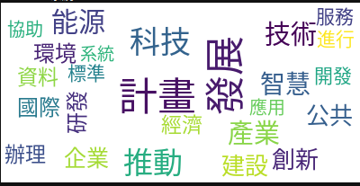
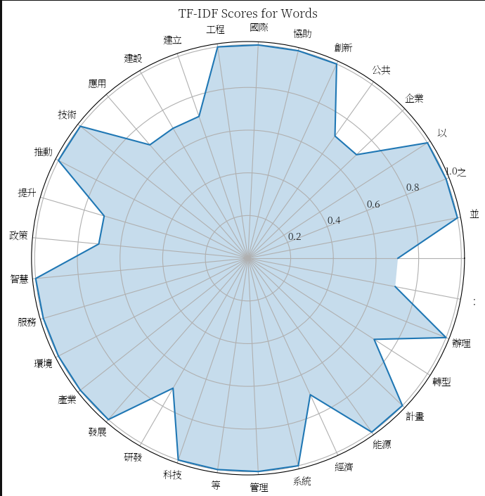
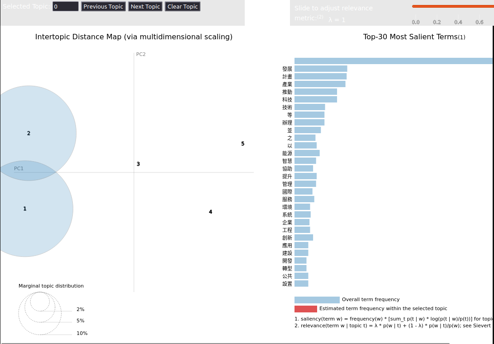
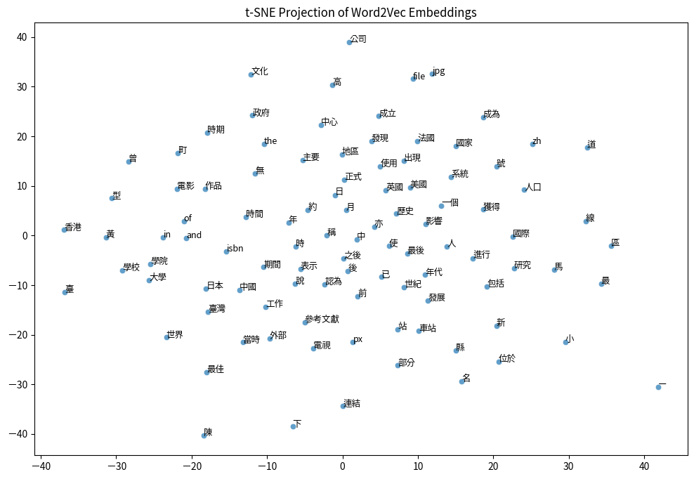

# The Visualization toolbox of Text Mining

### Temporary, language used 繁體中文(zhtw) as subject.
### The very first version: 
- with Word Cloud, and segmenting to words [wordcloud_jieba.ipynb](./wordcloud_jieba.ipynb) 
 
- to use a precise segmenting module [ckip_tagger.ipynb](./ckip_tagger.ipynb)
- a comparison method to show differences of TF-IDF scores, short article or sentences fit it [radar_plotting.ipynb](./radar_plotting.ipynb) 
 

### LDA-visualization
- A corpus level, huge volume of texts, to show pososible topic inside corpus [LDA_visualization.ipynb](./LDA_visualization.ipynb)  
 

### Word2Vec, and the others techniques
- A basical and small corpus downloaded from wikipedia, and utilizing with that to produce a tSNE plotting, showing the trained vector for each words, [word2vec_vis.ipynb](./word2vec_vis.ipynb). 
 
- Now, some essay already proven that the 2 techniques, LDA and Word2Vec, could be combined to used. 
paper: [An integrated latent Dirichlet allocation and Word2vec method for generating the topic evolution of mental models from global to local](https://www.sciencedirect.com/science/article/abs/pii/S0957417422017250)

Ref:https://github.com/zake7749/word2vec-tutorial